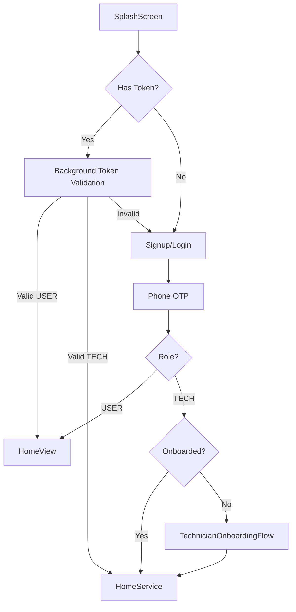
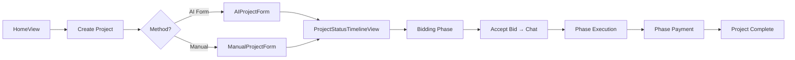
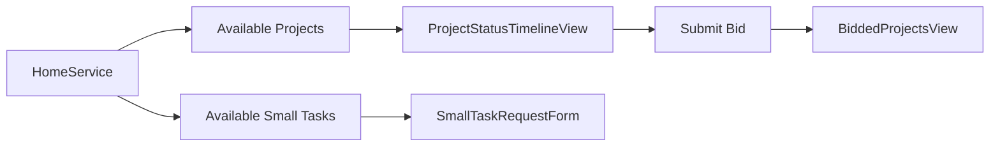

# Bonyad — Home Services Platform

A bilingual (Arabic/English) iOS app connecting homeowners with verified service providers for projects, repairs, and small tasks.

---

## Tech Stack

| Layer | Technology |
|-------|-----------|
| UI | SwiftUI (iOS 18.6+) |
| Backend | REST API (Spring Boot) |
| Realtime Chat | MQTT + Firebase Firestore |
| Push Notifications | Firebase Cloud Messaging |
| Payments | HyperPay (MADA, Visa, Apple Pay) |
| Maps | Google Maps SDK |
| Analytics | Mixpanel, Firebase Analytics |
| Auth | Phone OTP, Google Sign-In, Face ID |
| Localization | Arabic + English (`.lproj` bundles) |

---

## Installation

```bash
# Clone repository
git clone <repo-url>
cd bonyad-cr-2

# Install CocoaPods dependencies
pod install

# Open workspace (not .xcodeproj)
open bonyad-cr-2.xcworkspace
```

> **Requirements:** Xcode 16+, iOS 18.6 SDK, CocoaPods

### OTP / PIN push notification copy (backend)

SMS or FCM bodies for forgot-password OTP are generated on the **server**, not in this iOS repo. To change text such as `pin code :#### رمز التحقق`, update the Spring Boot (or SMS gateway) template. A clearer bilingual example:

`PIN Code: #### رمز التحقق هو: ####`

The app only displays the notification payload as sent by the backend.

---

## Project Structure

```
bonyad-cr-2/
├── App/
│   ├── Components/          # 23 reusable UI components
│   │   ├── BonyadAlert.swift
│   │   ├── CustomFeedbackView.swift
│   │   ├── SVGImageView.swift
│   │   ├── UnifiedServiceIconView.swift
│   │   ├── OfferCard.swift
│   │   ├── PdfView.swift
│   │   └── ...
│   │
│   ├── Demo/                # 5 interactive demo/onboarding helpers
│   │   ├── TechnicianDemoManager.swift
│   │   └── ...
│   │
│   ├── Intro/               # App intro flow
│   │   └── IntroView.swift
│   │
│   ├── LiveActivity/        # iOS Live Activity widgets
│   │   ├── ProjectLiveActivityAttributes.swift
│   │   └── ...
│   │
│   ├── Models/              # 11 pure data models (Codable)
│   │   ├── ProjectRequest.swift
│   │   ├── ServiceModel.swift
│   │   ├── BidModels.swift
│   │   ├── Offer.swift
│   │   ├── PortfolioModels.swift
│   │   ├── ProjectListing.swift
│   │   ├── UserDetails.swift
│   │   ├── PhasePaymentModels.swift
│   │   ├── SheetType.swift
│   │   ├── CategoryModels.swift
│   │   └── MockTechnicianData.swift
│   │
│   ├── Networking/          # URLSession extensions
│   │   └── URLSession+Fallback.swift
│   │
│   ├── Screens/             # All app screens organized by domain
│   │   ├── HomeView.swift             # Main user home screen
│   │   ├── HomeComponents/            # 13 home-screen sub-components
│   │   │   ├── HomeSmallTasksList.swift
│   │   │   ├── HomeProjectsList.swift
│   │   │   ├── HomeSmallTasksListForTechnician.swift
│   │   │   └── ...
│   │   │
│   │   ├── Auth/                      # 6 authentication screens
│   │   │   ├── Signup.swift
│   │   │   ├── otp.swift
│   │   │   ├── GoogleAuth.swift
│   │   │   ├── ForcedPasswordChangeView.swift
│   │   │   ├── resetpass.swift
│   │   │   └── resetpasssecond.swift
│   │   │
│   │   ├── Chat/                      # 4 chat screens
│   │   │   ├── ChatbotView.swift
│   │   │   ├── chatview.swift         # Main MQTT chat
│   │   │   └── ...
│   │   │
│   │   ├── Account/                   # 8 account management screens
│   │   │   ├── CardManagementView.swift
│   │   │   ├── NotificationsView.swift
│   │   │   ├── AppointmentsListView.swift
│   │   │   ├── ContractsListView.swift
│   │   │   ├── AcceptedOffersView.swift
│   │   │   ├── MyListingsWithOffersView.swift
│   │   │   ├── OffersListView.swift
│   │   │   └── DeleteAccountPasswordSheet.swift
│   │   │
│   │   ├── Profile/                   # 5 profile screens
│   │   │   ├── MyProfile.swift
│   │   │   ├── profile.swift
│   │   │   ├── techuserprofile.swift
│   │   │   ├── CompleteProfileView.swift
│   │   │   └── CompleteTechnicianProfileView.swift
│   │   │
│   │   ├── Admin/                     # Admin tools
│   │   │   └── AdminPasswordResetView.swift
│   │   │
│   │   ├── Onboarding/               # Onboarding flow
│   │   │   └── OnboardingView.swift
│   │   │
│   │   ├── ServiceProvider/           # 24 technician-facing screens
│   │   │   ├── HomeService.swift      # Technician home (AnalyticsService inside)
│   │   │   ├── TechnicianProfileManagementView.swift
│   │   │   ├── BiddedProjectsView.swift
│   │   │   ├── PortfolioManagementView.swift
│   │   │   ├── CommissionPaymentView.swift
│   │   │   ├── TechnicianOnboardingFlow.swift
│   │   │   ├── ServiceProvidersView.swift
│   │   │   └── ...
│   │   │
│   │   ├── new_request/               # 56 project + small-task screens
│   │   │   ├── ProjectStatusTimelineView.swift  # Main project timeline
│   │   │   ├── ProjectsListView.swift
│   │   │   ├── AIProjectForm.swift
│   │   │   ├── SmallTaskRequestForm.swift
│   │   │   ├── ChangeRequestView.swift
│   │   │   └── ...
│   │   │
│   │   ├── payment/                   # Payment screens
│   │   │   └── TransactionsView.swift
│   │   │
│   │   └── support/                   # 3 support screens
│   │       ├── SupportCenterView.swift
│   │       ├── CreateTicketView.swift
│   │       └── TicketRatingView.swift
│   │
│   ├── Services/            # 19 network/business-logic services
│   │   ├── CategoryService.swift
│   │   ├── TechnicianProjectService.swift
│   │   ├── TechnicianSearchService.swift
│   │   ├── TechnicianService.swift
│   │   ├── SmallTaskService.swift
│   │   ├── VisitRequestService.swift
│   │   ├── HyperPayService.swift
│   │   ├── HyperPayCustomUIService.swift
│   │   ├── DigitalSigningService.swift
│   │   ├── PhasePaymentService.swift
│   │   ├── FirestoreService.swift
│   │   ├── AISearchService.swift
│   │   ├── AccountService.swift
│   │   ├── MADAPaymentHelper.swift
│   │   ├── PaymentConfig.swift
│   │   ├── OnboardingStatusService.swift
│   │   ├── SetupDataManager.swift
│   │   ├── TechnicianStatusService.swift
│   │   └── TermsService.swift
│   │
│   ├── Utils/               # 47 utilities, helpers, extensions
│   │   ├── FeedbackManager.swift      # In-app toast/alert system
│   │   ├── BaseURLManager.swift
│   │   ├── SessionManager.swift       # Auth session & token
│   │   ├── TokenValidator.swift
│   │   ├── DesignSystem.swift
│   │   ├── FontManager.swift
│   │   ├── ChatDeepLinkManager.swift
│   │   ├── NotificationDeepLinkManager.swift
│   │   ├── MQTTChatManager.swift
│   │   ├── MQTTPresenceManager.swift
│   │   ├── PaymentTransactionService.swift
│   │   ├── AdminPasswordResetService.swift
│   │   ├── ChatbotAPIService.swift
│   │   ├── KeychainHelper.swift
│   │   ├── DateFormatterHelper.swift
│   │   ├── compressImage.swift
│   │   ├── PDFFormFiller.swift
│   │   ├── View+FeedbackModifier.swift
│   │   └── ...
│   │
│   └── Widgets/             # Home screen widget support
│       ├── ProjectNotificationManager.swift
│       └── ProjectWidgetModels.swift
│
├── bonyad_cr_2App.swift     # App entry point (URLCache + DeepLinkRouter here)
├── SplashScreenView.swift   # Splash screen
│
├── BonyadWidgets/           # WidgetKit extension target
│   ├── BonyadWidgets.swift  # All widget + Live Activity views
│   ├── AppIntent.swift      # Widget configuration intent
│   ├── Info.plist
│   └── Assets.xcassets/
│
└── BonyadNotificationContent/  # Notification Content extension target
    ├── NotificationViewController.swift  # Rich push notification host
    ├── UberStyleNotificationView.swift   # Live tracking card UI
    ├── MainInterface.storyboard
    └── Info.plist
```

---

## App Flow

### Authentication Flow



### User Project Flow



### Technician Home Flow



---

## Key Features

| Feature | Description |
|---------|-------------|
| **Dual Role** | Separate UX for Users and Service Providers |
| **AI Project Form** | Natural-language project creation via AI |
| **Phase-Based Projects** | Milestone tracking with phase payments |
| **Small Tasks** | Quick one-off jobs with instant bidding |
| **MQTT Chat** | Real-time messaging between user & technician |
| **HyperPay Payments** | MADA, Visa, Apple Pay, Partial Payments |
| **Portfolio** | Technicians showcase past work + QR codes |
| **Live Activities** | iOS Dynamic Island + CarPlay dashboard — tappable, deep links to project |
| **Home Screen Widgets** | Small/Medium/Large project status widget with project-specific deep links |
| **Rich Notifications** | Custom content extension — project cards + Uber-style live tracking |
| **Bilingual** | Full Arabic (RTL) + English support |
| **FeedbackManager** | Custom toast notifications — no native alerts |

---

## Performance Optimizations

The following optimizations were applied in the latest session:

### 1. Search Debouncing (`HomeView.swift`)

- Added 300ms `Task`-based debounce to search `onChange` handler
- Prevents excessive API calls on every keystroke

### 2. Lazy Loading

- `HomeView.swift`: Main `VStack` → `LazyVStack` (renders only visible items)
- `chatview.swift`: Messages `VStack` → `LazyVStack`
- `HomeService.swift`: Project/task `HStack`s → `LazyHStack`

### 3. Animation Lifecycle Management

- Added `onDisappear` to 7 skeleton/loading views to stop `repeatForever` animations
- Affected: `ServiceGridSkeleton`, `CircularIconSkeleton`, `AllServicesCardSkeleton`, `SmallTaskCardSkeleton`, `HomeProjectCardSkeleton`, `SeeMoreProjectsCard`, `SeeMoreTasksCard`

### 4. Draft Save Debouncing (`chatview.swift`)

- Added 500ms debounce to `saveDraft()` (was writing to `UserDefaults` on every keystroke)

### 5. Network Caching (`HomeService.swift` → `AnalyticsService`)

- 5-minute in-memory cache for `suggestedProjects` and `availableSmallTasks`
- Subsequent home visits return instantly from cache
- `invalidateCache()` method for manual refresh

### 6. Stable `ForEach` IDs (`HomeView.swift`)

- Replaced `ForEach(0..<services.count, id: \.self)` with `ForEach(Array(services.enumerated()), id: \.offset)`

### 7. Parallelized API Calls (`ProjectStatusTimelineView.swift`)

- `loadProjectData()` now uses `async let` to parallelize project details + phases fetch
- Also parallelizes my-bids + visit-requests fetches for service providers

### 8. Image Caching (`chatview.swift`, `bonyad_cr_2App.swift`)

- Configured `URLCache.shared` at launch: 50MB memory + 200MB disk
- New `CachedAsyncImage` component backed by `URLSession` with `.returnCacheDataElseLoad`
- Replaced raw `AsyncImage` in chat rooms list and message attachments

---

## API Endpoints Reference

| Method | Endpoint | Description |
|--------|----------|-------------|
| POST | `/auth/login` | Phone + OTP login |
| GET | `/auth/validate-token` | Token validation |
| GET | `/projects/my` | User's projects |
| GET | `/api/projects` | All available projects (technician) |
| POST | `/api/projects` | Create new project |
| GET | `/projects/:id` | Project details |
| GET | `/bids/project/:id` | Project bids |
| POST | `/bids/create` | Submit bid |
| GET | `/small-tasks/requests/available` | Available small tasks |
| POST | `/small-tasks/requests` | Create small task request |
| GET | `/time-requests/upcoming-appointments` | Upcoming appointments |
| GET | `/portfolios/generate-pdf` | Generate portfolio PDF |
| GET | `/portfolios/qr-code/:userId` | Portfolio QR code |
| POST | `/payments/initiate` | Initiate HyperPay payment |
| GET | `/categories` | Service categories |

---

## Key Components

### FeedbackManager

Global toast/banner notification system. All alerts in the app use this instead of native `UIAlertController`:

```swift
FeedbackManager.shared.showSuccess("project_created".localized)
FeedbackManager.shared.showError("network_error".localized)
FeedbackManager.shared.showWarning("fill_required_fields".localized)
BonyadAlertManager.shared.showConfirmation(
    title: "confirm_delete".localized,
    message: "this_action_cannot_be_undone".localized,
    onConfirm: { deleteItem() }
)
```

### AnalyticsService

Located in `HomeService.swift`. Manages technician home data with 5-minute in-memory caching:

```swift
class AnalyticsService: ObservableObject {
    func fetchAnalytics(token: String) async  // fetches projects + tasks in parallel
    func invalidateCache()                    // force refresh
}
```

### CachedAsyncImage

Located in `chatview.swift`. Uses `URLCache.shared` (50MB memory, 200MB disk configured at launch):

```swift
CachedAsyncImage(url: URL(string: imageUrl), width: 50, height: 50)
```

### DeepLinkRouter

Located in `bonyad_cr_2App.swift`. Central handler for `bonyad://` deep links from widgets and Live Activities (including CarPlay taps):

```swift
DeepLinkRouter.shared.handle(url: URL(string: "bonyad://project/123")!)
// → sets pendingProjectId = "123"
// → SplashScreenView presents ProjectStatusTimelineView(projectId: "123") in a sheet
```

---

## Localization

| Language | File | Status |
|----------|------|--------|
| Arabic | `ar.lproj/Localizable.strings` | Complete (263+ keys) |
| English | `en.lproj/Localizable.strings` | Complete |

All user-facing strings use the `.localized` extension:

```swift
Text("project_created_successfully".localized)
```

---

## App Extensions

### BonyadWidgets — WidgetKit Extension

**Bundle ID:** `com.bonyad.ahmed.BonyadWidgets`

Provides two widgets registered in `BonyadWidgetsBundle`:

#### 1. Home Screen Widget — `ProjectHomeWidget`

Displays the user's primary active project on the iOS home screen or lock screen.

| Size | Content |
|------|---------|
| Small | Project name, type, progress bar, percentage |
| Medium | Project name/type, phase name, phase `x of y`, progress bar + circular ring |
| Large | Full breakdown — header, current phase card, segmented phase indicators |

**Data flow:** The main app writes project data to `UserDefaults(suiteName: "group.com.bonyad.shared")` under key `widget_projects_data` as a JSON-encoded `[WidgetProject]` array. The widget reads it via `ProjectWidgetProvider` and refreshes every 15 minutes.

**Deep linking:** Tapping any widget size opens `bonyad://project/{projectId}` which routes to `ProjectStatusTimelineView` for that project via `DeepLinkRouter`.

```swift
// Main app writes widget data
let encoder = JSONEncoder()
encoder.dateEncodingStrategy = .iso8601
let data = try encoder.encode(projects)
UserDefaults(suiteName: "group.com.bonyad.shared")?
    .set(data, forKey: "widget_projects_data")
WidgetCenter.shared.reloadTimelines(ofKind: "ProjectHomeWidget")
```

#### 2. Live Activity / Dynamic Island — `ProjectPhaseLiveActivityWidget`

Shows real-time project phase progress in the iOS Dynamic Island and on the lock screen. **This widget also appears on the CarPlay dashboard.**

| Surface | Layout |
|---------|--------|
| Dynamic Island Compact | Phase number badge (left) + `xx%` progress (right) |
| Dynamic Island Expanded | Phase badge, project name, progress bar, phase dot indicators, days remaining |
| Dynamic Island Minimal | Circular progress ring with current phase number |
| Lock Screen | Phase badge + project name + phase name + days remaining + progress ring |
| **CarPlay Dashboard** | Same as lock screen — tappable, opens `ProjectStatusTimelineView` |

**CarPlay tappability:** The lock screen view has `.widgetURL(URL(string: "bonyad://project/\(context.attributes.projectId)"))`. When the user taps it on CarPlay, iOS opens the main app at that project's timeline.

```swift
// Start a Live Activity from the main app
let attributes = ProjectPhaseAttributes(
    projectId: project.id,
    projectName: project.name,
    totalPhases: project.phases.count
)
let state = ProjectPhaseState(
    currentPhase: 2,
    phaseName: "Structure",
    phaseProgress: 0.4,
    overallProgress: 0.35,
    daysRemaining: 12
)
let activity = try Activity<ProjectPhaseAttributes>.request(
    attributes: attributes,
    contentState: state,
    pushType: nil
)
```

**Attributes model:**

```swift
struct ProjectPhaseAttributes: ActivityAttributes {
    let projectId: String    // used in deep link URL
    let projectName: String
    let totalPhases: Int
}
struct ProjectPhaseState: Codable, Hashable {
    var currentPhase: Int
    var phaseName: String
    var phaseProgress: Double   // 0.0–1.0 (current phase only)
    var overallProgress: Double // 0.0–1.0 (whole project)
    var daysRemaining: Int
}
```

---

### BonyadNotificationContent — Notification Content Extension

**Bundle ID:** `com.bonyad.ahmed.BonyadNotificationContent`

Renders rich custom UI inside push notifications. Activates for these notification categories (declared in `Info.plist`):

| Category | UI Displayed |
|----------|--------------|
| `PROJECT_REMINDER` | Compact progress ring card — project name, notification type, days remaining, progress % |
| `PROJECT_DEADLINE` | Same as above, days count turns red when < 3 |
| `PROJECT_MILESTONE` | Same with milestone star icon |
| `LIVE_TRACKING` | **Uber-style live tracking card** (see below) |
| `TECHNICIAN_ARRIVING` | Same as LIVE_TRACKING |

All notifications render at **60pt height** (compact, lock-screen-friendly).

#### Project Notification Card (`RichNotificationView`)

```
┌──────────────────────────────────────┐
│  [Phase ring icon]  Project Name      │  [XX%]
│                     Phase Reminder • 3d         │
└──────────────────────────────────────┘
```

**Push notification payload fields:**

```json
{
  "project_id": "123",
  "project_name": "Villa Renovation",
  "notification_type": "phase_reminder",
  "title": "Phase 2 due in 3 days",
  "message": "Complete structural work",
  "phase_name": "Structure",
  "progress": 0.45,
  "days_remaining": 3
}
```

#### Live Tracking Card (`UberStyleNotificationView`)

Uber/Google Maps style card showing a technician en route. Compact lock screen mode:

```
┌──────────────────────────────────────┐
│  [Vehicle icon]  Ahmed Hassan         │  [2.4]
│  with progress   🔵 LIVE • ⏱ 8 min  │   km
│  ring            • ABC 1234           │
└──────────────────────────────────────┘
```

Full expanded mode (when notification is expanded from the notification center) shows an animated map route visualization with:

- Stylized grid map background
- Bezier curve route (grey = total, blue = completed progress)
- Animated vehicle marker moving along the route
- Driver info card (name, rating, vehicle number, call/message buttons)
- "Track on Map" and "Dismiss" action buttons

**Push notification payload fields:**

```json
{
  "category": "LIVE_TRACKING",
  "project_id": "456",
  "project_name": "Home Repair",
  "technician_name": "Ahmed Hassan",
  "vehicle_type": "truck",
  "vehicle_number": "ABC 1234",
  "eta_minutes": 8,
  "distance_km": 2.4,
  "current_location": "Al Olaya District",
  "destination": "Your Villa Project",
  "route_progress": 0.65,
  "status": "en_route",
  "latitude": 24.7136,
  "longitude": 46.6753
}
```

#### Action Handlers

The notification extension handles three action identifiers, all forwarding to the main app after dismissal:

```swift
"mark_done"    → .dismissAndForwardAction
"snooze"       → .dismissAndForwardAction
"view_project" → .dismissAndForwardAction
```

---

### Deep Link Routing

All widgets use the `bonyad://` URL scheme to navigate inside the app.

| URL | Destination |
|-----|-------------|
| `bonyad://project/{id}` | Opens `ProjectStatusTimelineView` for that project |
| `bonyad://project/widget` | Opens the app's project list |

The `DeepLinkRouter` class (in `bonyad_cr_2App.swift`) parses incoming URLs, and `SplashScreenView` listens via `onChange(of: deepLinkRouter.pendingProjectId)` to present the correct view in a sheet.

```swift
// How it flows:
// 1. User taps widget/Live Activity/CarPlay → iOS calls onOpenURL
// 2. DeepLinkRouter.handle(url:) parses "bonyad://project/123"
// 3. SplashScreenView.onChange fires → sets widgetProjectId = "123"
// 4. Sheet presents: NavigationStack > ProjectStatusTimelineView(projectId: "123")
```

> **Required Setup:** Add `App Groups` entitlement (`group.com.bonyad.shared`) to both the main app target and `BonyadWidgets` target so the widget can read data shared by the main app.

---

## Bonyad in-app assistant (ngrok API)

The chatbot in **`ChatbotView`** talks to the Bonyad assistant over HTTPS. The iOS client is implemented in **`ChatbotAPIService.swift`** (health check, new conversation, send message).

### Default base URL

The tunnel URL changes whenever ngrok restarts. The default is set in code as `ChatbotAPIService.defaultBaseURL`. To point the app at another tunnel **without rebuilding**, set UserDefaults once (e.g. in a debug menu or lldb):

```text
Key:   chatbot_base_url_override
Value: https://YOUR-SUBDOMAIN.ngrok-free.dev   // no trailing slash
```

Or update `defaultBaseURL` in `ChatbotAPIService.swift` and ship a build.

### Endpoints (relative to base URL)

| Step | Method | Path | Purpose |
|------|--------|------|--------|
| 1 | `GET` | `/health` or `/api/health` | Expect JSON `{"status":"ok"}` (first path that succeeds wins). |
| 2 | `POST` | `/api/chat/new` | Start a conversation. Body: `userId` (string), `userType` (`USER` or `TECHNICIAN`). Response: `conversationId`. |
| 3 | `POST` | `/api/chat` | Send a message. Body: `message`, `conversationId`, `userId`, `userType`, `language` (`en` / `ar`). Response: `response` (assistant text). |

iOS sends **`ngrok-skip-browser-warning: true`** on every request to reduce ngrok free-tier HTML interstitials.

`userId` / `userType` come from **`SessionManager`** (`guest` when logged out). Each time **`ChatbotView`** appears, **`resetSession()`** runs so the next message opens a **new** server conversation.

### Optional: Gradio UI

Open the same base URL in Safari to use the hosted Gradio chat UI for manual testing.

### Backend checklist for developers

1. Run the assistant server and expose it with ngrok.
2. Confirm `GET …/health` returns `{"status":"ok"}`.
3. Put the ngrok URL in `ChatbotAPIService.defaultBaseURL` or `chatbot_base_url_override`.
4. Clean build, run the app, open **Bonyad Assistant** and send a message.

---

## Product backlog: tasks, platforms, and AI prompts

Use this section to track work across **iOS**, **Android**, **Web**, and **Backend**. Copy the **AI prompt** into your coding assistant when starting a task. Import rows into your issue DB (Jira, Linear, Notion, etc.) as needed.

**Platform key:** `iOS` · `Android` · `Web` · `Backend` · `DB` (schema/migrations/flags)

---

### Task 1 — Attachments: photos **and files** on manual + AI project creation

**Goal:** Users can add **photos** (existing) plus **files** (PDF, images, etc.) when creating a project via **Manual** and **AI** flows.

| Platform | Scope |
|----------|--------|
| **Backend** | Extend create/update project APIs to accept multipart file uploads or signed URLs; validate type/size; store metadata in DB; link to `project_id`. |
| **DB** | Table or columns for `project_attachments` (id, project_id, file_url, mime_type, size, created_at, source: manual\|ai). |
| **iOS** | `ManualProjectForm`, `AIProjectForm` / conversational flow: file picker (`UIDocumentPicker`), upload pipeline, show list of pending uploads, error handling; reuse or extend photo flow. |
| **Android** | Same UX parity: document picker, upload, list. |
| **Web** | File input + upload to same API. |

**Steps**

1. Backend: define attachment model + endpoints (list/upload/delete for draft/submitted project).
2. iOS: add “Add file” next to photos; integrate with project submit payload.
3. Mirror on Android/Web.
4. QA: large files, denied permissions, offline, RTL.

**AI prompt (paste to implement on this repo — iOS first)**

```text
In the Bonyad iOS app (SwiftUI), add non-photo file attachments to project creation for both ManualProjectForm and the AI project flows (AIProjectForm / summary submit path). Use UIDocumentPicker (or PHPicker for images only where appropriate) to let users pick PDFs and common document types. Reuse BaseURLManager and existing multipart patterns if any; otherwise add an upload service that POSTs files to the backend project attachment endpoint (define a plausible path and Request models). Show selected files in a list with remove; disable submit until uploads succeed or queue with project create. Match ThemeManager and existing ManualProjectForm photo UX. Do not remove existing photo support.
```

---

### Task 2 — Home “quick services”: max **6** services + Arabic copy changes

**Goal:** The horizontal “quick services” area shows **only six** curated services (not the full catalog). Update Arabic strings:

| Current (concept) | New |
|-------------------|-----|
| `quick_services` → “الخدمات السريعة” | **“الخدمات الرئيسية”** (Main services) |
| Section for small task types (e.g. `small_task_types` / “أنواع المهام الصغيرة”) | **“المهام البسيطة”** (Simple tasks) |

| Platform | Scope |
|----------|--------|
| **iOS** | Limit data source to six IDs/categories in `HomeView` (or dedicated config); adjust localized strings in `ar.lproj` / `en.lproj` / PerView bundles. |
| **Android** / **Web** | Same limit + strings. |
| **Backend** *(optional)* | Config endpoint `GET /config/home-quick-services` returning six `categoryId`s so CMS can change without app release. |

**Steps**

1. Define the six services (product + backend IDs).
2. Replace “load all” with “load six” (or filter client-side).
3. Update `Localizable.strings` keys: `quick_services`, `small_task_types` (and any duplicates in `Localizations/PerView/**`).
4. Verify LTR/RTL layout on home.

**AI prompt**

```text
In bonyad-cr-2 iOS project, find where HomeView (or equivalent) loads quick services / small tasks horizontal lists. Cap the quick services carousel to exactly 6 items from a constant array of category IDs or slugs (placeholder IDs with a TODO). Update Arabic localization: change key quick_services to "الخدمات الرئيسية" and small_task_types to "المهام البسيطة" in ar.lproj and mirrored PerView Arabic files; add sensible English strings in en.lproj. Do not change unrelated screens.
```

---

### Task 3 — Tab bar: title under **every** tab (active and inactive)

**Goal:** Tab labels appear **below all tabs**, not only the selected one (fix inconsistent custom tab bar).

| Platform | Scope |
|----------|--------|
| **iOS** | Custom tab bar component(s): ensure each tab shows icon + title; selected state only changes style (color/weight), not visibility of label. |
| **Android** | `BottomNavigationView` labels always visible (`LABEL_VISIBILITY_LABELED`) or custom bar parity. |

**Steps**

1. Locate custom `TabBar` / `MainTabView` / container views.
2. Remove logic that hides `Text` for unselected tabs.
3. Snapshot tests or manual QA on smallest device.

**AI prompt**

```text
Find the main user tab bar implementation in the iOS app (SwiftUI). Ensure the title/label string appears under every tab item for both selected and unselected states; use opacity or color to distinguish selection instead of hiding the label. Keep RTL safe. List files changed.
```

---

### Task 4 — “My projects”: add **small tasks** entry for user and technician

**Goal:** Both **user** and **technician** “My projects” (or equivalent) surfaces include a clear path to **small tasks** (list, filter, or segment).

| Platform | Scope |
|----------|--------|
| **iOS** | `ProjectsListView` / technician project list: add bar, segment, or section linking to small tasks flow. |
| **Backend** | If small tasks are separate resources, ensure list APIs support “mine” for both roles. |

**Steps**

1. UX: decide chip vs tab vs section header.
2. Wire navigation to existing small-task screens.
3. Mirror for technician role.

**AI prompt**

```text
On iOS Bonyad app, locate the user's "My projects" screen and the technician's projects/home list. Add a visible "Small tasks" access point (e.g. horizontal bar, segmented control, or tappable row) that navigates to the existing small tasks list or creation flow. Use existing localization keys like small_tasks or my_small_tasks. Respect technician vs user navigation stacks.
```

---

### Task 5 — Remove **booking** system app-wide (temporary)

**Goal:** Hide or disable **appointment booking / booking calendar** flows everywhere until product brings them back.

| Platform | Scope |
|----------|--------|
| **iOS** | Remove or `#if DEBUG` / feature-flag tab entries, sheets, CTAs (`needs_booking`, calendar tab, confirm booking, etc.). |
| **Android** / **Web** | Same. |
| **Backend** | Feature flag `bookings_enabled=false`; return 404/410 or empty for booking endpoints; stop push templates that assume booking. |

**Steps**

1. Product: confirm scope (provider availability vs user booking).
2. Grep codebase for `booking`, `Book`, calendar tab routes.
3. Backend flag + client guard.
4. Document re-enable steps in this README.

**AI prompt**

```text
Search the iOS codebase for user-facing booking features: calendar tab, booking confirmation, needs_booking toggles, and appointment scheduling UI. Behind a single Swift feature flag defaulting to false (or remove entry points), hide navigation to booking and disable booking-related buttons. Do not delete models if still used by project payloads; prefer hiding. Summarize all entry points touched.
```

---

### Task 6 — User tab bar: replace **Calendar** with **Small tasks**

**Goal:** Main user bottom bar uses a **Small tasks** tab instead of calendar (aligns with Task 5).

| Platform | Scope |
|----------|--------|
| **iOS** | Tab item: icon + `small_tasks` / `my_small_tasks` label → root for small task list. |
| **Android** / **Web** | Same tab order change. |

**Steps**

1. Identify tab enum / indices.
2. Swap calendar destination for small tasks root.
3. Update any deep links that targeted calendar.

**AI prompt**

```text
In the iOS app main tab bar for end users, replace the Calendar tab with a Small Tasks tab that opens the primary small tasks screen (reuse existing view). Remove or repurpose the calendar tab. Update tab accessibility labels and localized titles. Ensure technician tab bar unchanged unless shared code requires a split.
```

---

### Task 7 — Arabic: **Beta** label

**Goal:** Replace **“بيتا”** with **“نسخة تجريبية”** (trial / beta build labeling).

| Platform | Scope |
|----------|--------|
| **iOS** | `ar.lproj/Localizable.strings` key `beta` (and duplicates in PerView). |
| **Android** / **Web** | Same string in `values-ar`. |

**Steps**

1. Grep `beta` / `بيتا` in repo.
2. Update all Arabic bundles; keep English “Beta” if desired.

**AI prompt**

```text
Find all Arabic localizations for the beta label (key "beta" and any hardcoded بيتا). Set the Arabic value to "نسخة تجريبية" in ar.lproj and Localizations/PerView Arabic files. Do not change unrelated keys.
```

---

### Task 8 — Help / tutorial example: kitchen → **room on roof**

**Goal:** Replace the onboarding/help example about **kitchen** with **building a room on the roof** (EN + AR).

| Platform | Scope |
|----------|--------|
| **iOS** | Tutorial strings, demo narrations, `AIProjectForm` / chatbot examples if they mention kitchen. |
| **Backend** | Default examples in CMS or API if any. |

**Suggested copy**

- **EN:** e.g. “Building a room on the roof” / “I want to build a small room on my rooftop.”
- **AR:** e.g. “بناء غرفة على السطح”

**Steps**

1. Grep `kitchen`, `مطبخ`, `example_kitchen`, tutorial keys.
2. Replace with roof-room example; keep length similar for UI.

**AI prompt**

```text
Search the iOS project for user-visible example text that describes a kitchen renovation (English or Arabic) in tutorials, AI prompts, or onboarding. Replace with an example about building a room on the roof: English short phrase + Arabic "بناء غرفة على السطح" where appropriate. Update Localizable.strings and any Swift string constants. List every key changed.
```

---

### Suggested import into a database (issues table)

| id | title | platforms | epic |
|----|--------|-----------|------|
| P1 | Project attachments (photos + files) manual + AI | iOS, Android, Web, Backend, DB | Create project |
| P2 | Quick services: limit 6 + AR rename main/simple tasks | iOS, Android, Web, Backend? | Home |
| P3 | Tab bar labels always visible | iOS, Android | Navigation |
| P4 | My projects: small tasks access user + tech | iOS, Backend? | Projects |
| P5 | Disable booking globally | All | Calendar / booking |
| P6 | User tab: Calendar → Small tasks | iOS, Android, Web | Navigation |
| P7 | AR beta string نسخة تجريبية | iOS, Android, Web | Localization |
| P8 | Tutorial example roof room | iOS, Backend? | Onboarding |

---

## Third-party Dependencies (via CocoaPods)

- `Firebase/Core`, `Firebase/Messaging`, `Firebase/Firestore`, `Firebase/Crashlytics`
- `GoogleMaps`, `GooglePlaces`
- `GoogleSignIn`
- `Mixpanel-swift`
- `CocoaMQTT` (MQTT chat)
- `SDWebImage`
- `SwiftJWT` (Swift Package Manager)
- `OPPWAMobile.xcframework` (HyperPay, local)

---

## License

Private — Bonyad Hub © 2025. All rights reserved.

---

*This document describes the **bonyad-cr-2** iOS codebase. It lives in the Nigents monorepo under `docs/` for cross-team reference alongside the Bonyad web briefs (`/bonyad`).*
